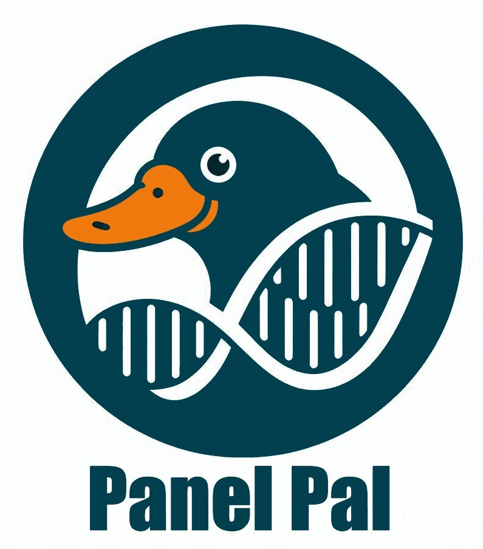

# PanelPal


**Note: This piece of software is in development as a university project and as yet is not a fully functioning or tested product. Use of this software is at your own risk.**

PanelPal is a python package of command line tools for helping UK labs implement the National Test Directory for rare disease. It uses API queries to get up-to-date information regarding NGS panels for germline disease.


## Features

- Fetch information about a panel using its R number ID.
- Compare the genes on two versions of a panel. 
- Create BED files for a genomic panels with chromosomal coordinates.


## Installation

To set up a conda environment for this project, you can use the provided `environment.yaml` file.

1. Clone or download this repository.

   ```bash
   git clone https://github.com/PatrickWeller/PanelPal.git
    ```

2. Create a new conda environment with the following command:

   ```bash
   conda env create -f env/environment.yaml
    ```

3. Activate the environment:

    ```bash
    conda activate PanelPal
    ```

4. Install PanelPal via pip

    ```bash
    cd PanelPal
    pip install .
    ```

## Usage

### Check Panel
To check and retrieve panel information from the PanelApp API:

```bash
#Either
PanelPal check-panel --panel_id R207

#Or
python PanelPal/check_panel.py --panel_id R207
```

### Compare Panel Versions
To compare the genes on two versions of a given panel:

```bash
#Either
PanelPal compare-panel-versions -p R21 -v 1.0 2.0

#Or
python PanelPal/compare_panel_versions.py --panel R21 --versions 1.0 2.0
```
### Generate Bed File
To generate a bed file for a given panel:

```bash
python PanelPal/generate_bed.py --panel_id R207 --panel_version 4 --genome_build GRCh38
```

## Directory structure
The following structure should be used going foward to keep the project directories tidy and in preparation for package build. This will also resolve issues importing modules going forward. Note: DB directory has been omitted from the tree for now.

```bash
.
├── env
│   ├── environment.yaml
│   └── requirements.txt
├── PanelPal
│   ├── accessories
│   │   ├── __init__.py
│   │   ├── panel_app_api_functions.py
│   │   └── variant_validator_api_functions.py
│   ├── check_panel.py
│   ├── compare_panel_versions.py
│   ├── generate_bed.py
│   ├── __init__.py
│   ├── logging
│   │   └── panelpal.log
│   ├── main.py
│   ├── settings.py
│   └── setup.py
├── README.md
└── test
    ├── __init__.py
    └── test_*.py
```

## License
To be confirmed.
