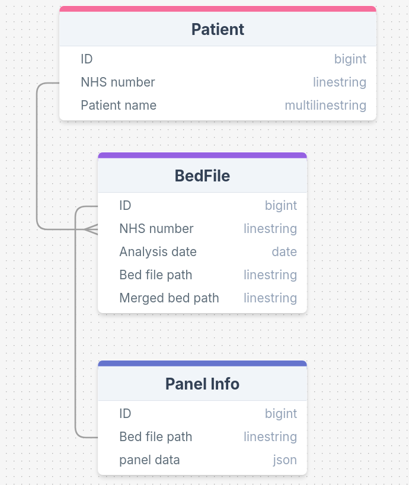

# PanelPal


**Note: This piece of software is in development as a university project and as yet is not a fully functioning or tested product. Use of this software is at your own risk.**

PanelPal is a python package of command line tools for helping UK labs implement the National Test Directory for rare disease. It uses API queries to get up-to-date information regarding NGS panels for germline disease.


## Features

- Fetch information about a panel using its R number ID.
- Compare the genes on two versions of a panel. 
- Create BED files for a genomic panels with chromosomal coordinates.


## Installation

To set up a conda environment for this project, you can use the provided `environment.yaml` file.

1. Clone or download this repository.

   ```bash
   git clone https://github.com/PatrickWeller/PanelPal.git
    ```

2. Create a new conda environment with the following command:

   ```bash
   conda env create -f env/environment.yaml
    ```

3. Activate the environment:

    ```bash
    conda activate PanelPal
    ```

4. Install PanelPal via pip

    ```bash
    cd PanelPal
    pip install .
    ```

## Usage

### Check Panel
To check and retrieve panel information from the PanelApp API:

```bash
#Either
PanelPal check-panel --panel_id R207

#Or
python PanelPal/check_panel.py --panel_id R207
```

### Get panels containing a given gene
To generate a list of panels containing a specific gene (e.g. BRCA1):

```bash
#Either
panelpal gene-panels --hgnc_symbol BRCA1

#Or
python PanelPal/gene_to_panels.py --hgnc_symbol BRCA1
```

### Compare Panel Versions
To compare the genes on two versions of a given panel:

```bash
#Either
PanelPal compare-panel-versions -p R21 -v 1.0 2.0 -f green

#Or
python PanelPal/compare_panel_versions.py --panel R21 --versions 1.0 2.0 --status_filter green
```

### Generate Bed File
To generate a bed file for a given panel:

```bash
#Either
python PanelPal/generate_bed.py --panel_id R207 --panel_version 4 --genome_build GRCh38 --status_filter green

#Or
PanelPal generate-bed --panel_id R207 --panel_version 4 --genome_build GRCh38 --status_filter green
```

### Compare Bed Files
To compare the content of two bed files:

```bash
#Either
python PanelPal/compare_bedfile.py bedfile1.bed bedfile2.bed

#Or
PanelPal compare-bed-files bedfile1.bed bedfile2.bed
```

## Directory structure
The following structure should be used going foward to keep the project directories tidy and in preparation for package build. This will also resolve issues importing modules going forward. Note: DB directory has been omitted from the tree for now.

```bash
.
├── env
│   ├── environment.yaml
│   └── requirements.txt
├── PanelPal
│   ├── accessories
│   │   ├── __init__.py
│   │   ├── panel_app_api_functions.py
│   │   └── variant_validator_api_functions.py
│   ├── check_panel.py
│   ├── compare_bedfiles.py
│   ├── compare_panel_versions.py
│   ├── generate_bed.py
│   ├── __init__.py
│   ├── logging
│   │   └── panelpal.log
│   ├── main.py
│   └── settings.py
├── README.md
├── setup.py
└── test
    ├── __init__.py
    └── test_*.py
```

## Database
PanelPal comes with an integrated database that is automatically created on startup and persists on the user's local computer or server. The database uses SQLAlchemy's Object-Relational Mapping (ORM) framework to store and manage patient information, BED file metadata, and panel data.

The schema consists of three main tables:



### Example Usage
As well as manually adding records using SQL queries, PanelPal provides a convenient way to insert data via its built-in `generate-bed` function. During this process, users are prompted to optionally enter patient information, which is then stored in the database.

Example prompt:
```bash
>>> patient_info = patient_info_prompt()
Add patient to database? (Default = 'yes', type 'n' to skip): yes
Patient ID (NHS number, 10 digits): 1234567890
Patient name: John Doe
Patient's date of birth (DD-MM-YYYY): 01-01-1990
>>> patient_info
{'patient_id': '1234567890', 'patient_name': 'John Doe', 'dob': datetime.date(1990, 1, 1)}
```
If the user chooses to skip entering patient information (by typing n), the system will proceed with generating the BED file without adding the patient record to the database.


## License
To be confirmed.
